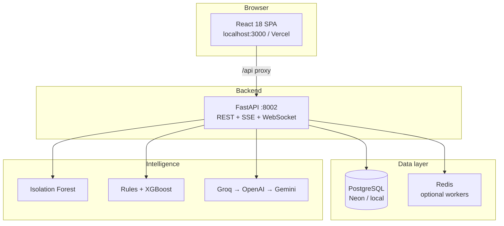

# SmartSpend Analytics

### AI-driven financial insights and risk monitoring

[](https://github.com/Cmsolanki29/final-exiqo)
[](https://github.com/Cmsolanki29/final-exiqo)
[](https://python.org)
[](https://reactjs.org)
[](https://fastapi.tiangolo.com)
[](https://neon.tech)

> **Your money, intelligently shielded.** — *From raw transactions to decisions before money is lost.*

**Built for hackathon demo** · Replace event/team name in badges as needed.

| Jump to | |
|---------|--|
| [Problem](#-problem-statement) | [Features](#-features) | [Architecture](#-architecture) |
| [Quick start (judges)](#-quick-start-for-judges) | [Run locally](#-run-locally) | [Demo script](#-demo-script-hackathon) |
| [Full setup guide](SETUP.md) | [API](#-api-highlights) | [Deploy](#-production-deployment) |

---

## Live links

| | URL |
|---|-----|
| **Web app** | _Set after Vercel deploy — e.g. `https://smartspend-analytics.vercel.app`_ |
| **API health** | _Set after Render deploy — e.g. `https://smartspend-backend.onrender.com/health`_ |
| **Swagger** | _e.g. `https://smartspend-backend.onrender.com/docs`_ |

> Render free tier may sleep after ~15 min idle — first request can take **30–60 seconds**.

---

## Problem statement

Digital transactions create large volumes of data, but most users get **no actionable intelligence** from it.

**We address three gaps:**

| # | Gap | SmartSpend response |
|---|-----|---------------------|
| 1 | **Data without insight** | Raw exports and PDFs → health score, trends, AI narratives grounded in *your* ledger |
| 2 | **Reactive fraud** | Losses found after money leaves → **FraudShield** pre-payment check + ML alerts + investigation |
| 3 | **Low financial self-awareness** | No simple view of savings, EMI load, leakages → dashboard, EMI trap detector, subscription verdicts |

---

## What we built

**SmartSpend Analytics** turns PostgreSQL transaction history into dashboards, ML anomaly flags, rule-based fraud checks, and optional AI (OpenAI / Groq / Gemini) explanations — tuned for **Indian context** (UPI, EMI, festivals, ₹).

Five pillars: **See** · **Protect** · **Save** · **Plan** · **Ask** — all feeding one **Financial State Engine** that recalculates monthly surplus and warns when overcommitted.

---

## Features

### Core

| Feature | Description |
|--------|-------------|
| **Dashboard** | Period-aware overview, charts, merchants, transactions (bank / card / merged) |
| **ML anomaly detection** | Isolation Forest flags suspicious transactions per user |
| **Health score** | 0–100 score with grade (A–F) and breakdown |
| **AI insights** | LLM monthly narrative and tips (Groq → OpenAI → Gemini waterfall) |
| **Scenario simulator** | “What if” projections on savings and health |
| **Statement upload** | CSV, Excel, text PDF — Axis, HDFC, ICICI parsers |

### Advanced

| Feature | Description |
|--------|-------------|
| **EMI trap detector** | Debt-to-income vs safe band; affordability before new EMI |
| **Subscription intelligence** | KEEP / REVIEW / CANCEL / UPGRADE verdicts + graveyard |
| **Dark pattern detector** | ₹1 traps, zombies, duplicates, price escalation |
| **FraudShield** | 12-phase stack — pre-send check, alerts, SHAP, LLM investigation |
| **Festival planner** | Indian festival calendar + savings targets vs surplus |
| **Purchase planner** | Goal milestones, EMI vs cash, sacrifice hints |
| **Trip planner** | Agent + MCP travel tools |
| **AI chat** | SSE streaming; context from DB, not generic finance tips |

<details>
<summary><strong>▶ FraudShield phases (expand)</strong></summary>

| Phase | Capability |
|-------|------------|
| 1–4 | Event engine, feature store, supervised scoring, decision engine |
| 5–8 | MLOps registry, graph intelligence, SHAP, feedback flywheel |
| 9–12 | LLM investigation agent, GNN (optional), DNN shadow, orchestrator |

Controlled via `.env`: `PHASE_9_AGENT_ENABLED`, `PHASE_12_ORCHESTRATOR_ENABLED`, etc.

</details>

---

## Architecture



| Layer | Path | Stack |
|-------|------|--------|
| **Frontend** | `frontend/` | React 18, Tailwind, Recharts, Framer Motion, Axios → `setupProxy.js` → **:8002** |
| **Backend** | `backend/` | FastAPI, scikit-learn, pandas, psycopg2, OpenAI-compatible clients |
| **Database** | `backend/database/migrations/` | Versioned SQL + `scripts/apply_migrations.py` |
| **Samples** | `test samples/` | Demo bank/card PDFs for upload |

<details>
<summary><strong>▶ Data → AI pipeline (expand)</strong></summary>

```
PostgreSQL (transactions, EMI, goals, festivals)
        │
        ▼
ai_context_service  — compress ledger (no raw rows to LLM)
        │
        ├──► Deterministic (health score, surplus, subscription verdicts)
        └──► LLM (insights, chat, investigation) — structured JSON only
```

Balances are **never hallucinated** — engines use real DB aggregates.

</details>

<details>
<summary><strong>▶ Backend modules (expand)</strong></summary>

| Module | Path | Role |
|--------|------|------|
| Auth & onboarding | `routes/auth.py`, `otp.py` | JWT, OTP, source selection |
| Documents | `routes/documents.py` | PDF/CSV/Excel ingestion |
| Dashboard | `routes/dashboard.py` | Scoped KPIs, trends |
| FraudShield | `routes/fraud_shield.py` | Full risk pipeline |
| AI chat & insights | `routes/ai_chat.py`, `insights.py` | SSE chat, insights waterfall |
| EMI / Festival / Purchase | `routes/emi_*.py`, `festival_*.py`, `purchase_planner.py` | Planning modules |
| Subscriptions | `routes/subscription_intelligence.py` | Verdict engine |
| Workers | `workers/*` | Alerts, drift, retrain (Redis) |

</details>

<details>
<summary><strong>▶ Frontend map (expand)</strong></summary>

| UI | Location |
|----|----------|
| Dashboard | `components/Dashboard/` |
| FraudShield | `components/FraudShield/` |
| EMI | `components/EMI/` |
| Subscriptions | `pages/SubscriptionHub` |
| AI chat | `pages/AIAnalysisEngine` |
| Festival / Purchase | `components/Festival/`, `components/Purchase/` |

</details>

---

## Quick start for judges

**Fastest path:** [SETUP.md](SETUP.md) — live demo URLs, local install, troubleshooting.

### One-click demo login

**Password for all:** `Pass@123`

| Email | Best for |
|-------|----------|
| `judgedemo1@judge.smartspend.example.com` | General dashboard |
| `judgedemo2@judge.smartspend.example.com` | **EMI / affordability demo** |
| `judgedemo4@judge.smartspend.example.com` | Rich transaction data |
| `judgedemo3@judge.smartspend.example.com` | Ananya Desai |
| `judgedemo5@judge.smartspend.example.com` | Neha Joshi |
| `judgedemo6@judge.smartspend.example.com` | Karan Ahuja |

### 5-minute walkthrough

1. Sign in → **judgedemo2** or **judgedemo4**
2. **Dashboard** — health score, KPIs, charts
3. **FraudShield** → **Check transaction** (KYC, lottery, collect quick tests)
4. **EMI Tracker** (judgedemo2)
5. **AI chat** — *“Where did I spend the most last month?”*

---

## Run locally

### Prerequisites

| Tool | Version |
|------|---------|
| Node.js | LTS 18+ |
| Python | 3.11+ (3.13 OK) |
| PostgreSQL | 14+ or [Neon](https://neon.tech) free tier |

### Environment

Copy `.env.example` → `.env` at **project root**:

| Variable | Required | Purpose |
|----------|----------|---------|
| `DB_*` or `DATABASE_URL` | Yes | PostgreSQL |
| `JWT_SECRET_KEY` | Yes | Auth tokens |
| `GROQ_API_KEY` | No* | AI chat, insights, planners |
| `OPENAI_API_KEY` / `GEMINI_API_KEY` | No | Insights waterfall fallbacks |

\*App runs without LLM keys — dashboard, fraud rules, and ML work; AI text uses graceful fallbacks.

<details>
<summary><strong>▶ Database setup (expand)</strong></summary>

**Local Postgres** — create DB once:

```sql
CREATE DATABASE smartspend_db;
```

**Apply schema + demo users** (from `backend/` with venv active):

```bash
python -m scripts.apply_migrations
python -m scripts.seed_judge_demo_users
```

Do **not** use legacy `database/schema.sql` only — migrations in `backend/database/migrations/` are the source of truth.

</details>

### Commands

**Terminal 1 — API**

```bash
git clone https://github.com/Cmsolanki29/final-exiqo.git
cd final-exiqo
cp .env.example .env
# edit .env

cd backend
python -m venv .venv
# Windows:  .\.venv\Scripts\Activate.ps1
# macOS/Linux:  source .venv/bin/activate
pip install -U pip wheel
pip install -r requirements-base.txt -r requirements-ml-risk.txt   # or requirements.txt
python -m scripts.apply_migrations
python -m scripts.seed_judge_demo_users
uvicorn main:app --reload --host 127.0.0.1 --port 8002
```

**Terminal 2 — Web**

```bash
cd frontend
npm install
npm start
```

| Service | URL |
|---------|-----|
| App | http://localhost:3000 |
| API | http://127.0.0.1:8002 |
| Swagger | http://127.0.0.1:8002/docs |
| Health | http://127.0.0.1:8002/health |

**Windows — one command** (repo root):

```powershell
.\start-dev.ps1
```

Dev proxy: `frontend/setupProxy.js` forwards `/api` → **8002** (no `REACT_APP_API_URL` needed locally).

<details>
<summary><strong>▶ Production build (expand)</strong></summary>

```bash
cd frontend
npm run build
```

Deploy `frontend/build` to Vercel; set `REACT_APP_API_URL=https://YOUR-BACKEND.onrender.com/api`.

See [Production deployment](#-production-deployment) below.

</details>

---

## Demo script (hackathon)

| Step | Action | Talking point |
|------|--------|----------------|
| 1 | Login **judgedemo2** | Pre-seeded realistic ledger — no upload wait |
| 2 | Dashboard — change month/year | Period-aware trends and health score |
| 3 | FraudShield → Check transaction | **Before** money leaves — not reactive |
| 4 | EMI trap detector | DTI vs safe band; defer goal to fix shortfall |
| 5 | Purchase planner + Festival strip | Planning tied to real surplus |
| 6 | AI insights (if key set) | Grounded in PostgreSQL, not generic ChatGPT |
| 7 | Mention graceful degradation | Works without OpenAI/Groq — rules + ML remain |

Sample PDFs: `test samples/` (Axis, HDFC).

---

## API highlights

| Endpoint | Description |
|----------|-------------|
| `GET /health` | DB + dependency status |
| `POST /api/auth/signin` | JWT login |
| `POST /api/documents/upload` | Statement ingestion |
| `GET /api/dashboard/{user_id}` | Scoped KPIs |
| `GET /api/insights/{user_id}` | AI bundle (month/year) |
| `POST /api/fraud-shield/{user_id}/check-transaction` | Live fraud check |
| `GET /api/purchases/{user_id}`, `GET /api/festivals/{user_id}` | Planners |
| `POST /api/ai-chat/{user_id}/stream` | Streaming chat (SSE) |

Full list: **Swagger** at `/docs` on your backend URL.

---

## Production deployment

<details>
<summary><strong>▶ Neon + Render + Vercel (expand)</strong></summary>

**1. Database — [Neon](https://neon.tech)**

```bash
cd backend
pip install -r requirements-render.txt
# set DATABASE_URL=postgresql://...?sslmode=require
python -m scripts.deploy_production_db
```

**2. Backend — [Render](https://render.com)** — connect repo, use `render.yaml`, set `DATABASE_URL`, `GROQ_API_KEY`, `FRONTEND_URL`.

**3. Frontend — [Vercel](https://vercel.com)** — root `frontend/`, env `REACT_APP_API_URL=https://YOUR-BACKEND.onrender.com/api`.

Redeploy backend after Vercel URL is known (CORS).

</details>

---

## Project structure

```
final-exiqo/
├── backend/           # FastAPI, ML, migrations, scripts/
├── frontend/          # React CRA, setupProxy → :8002
├── test samples/      # Demo PDFs
├── SETUP.md           # Judge quick-start (detailed)
├── render.yaml        # Render Blueprint
├── .env.example
└── SMARTSPEND_PROJECT_OVERVIEW.md
```

---

## Troubleshooting

<details>
<summary><strong>▶ Common issues (expand)</strong></summary>

| Issue | Fix |
|-------|-----|
| Backend not reachable | API must be on port **8002**; run `.\start-dev.ps1` |
| DB connection failed | Check `DATABASE_URL` / `DB_*`; Neon needs `?sslmode=require` |
| CORS (deployed) | `FRONTEND_URL` = exact Vercel URL, no trailing `/` |
| Slow first load | Render cold start — wait 60s or ping `/health` |
| AI empty | Set `GROQ_API_KEY` and restart backend |
| pip fails (Windows) | `requirements-base.txt` + `requirements-ml-risk.txt` |
| Port in use | `.\start-dev.ps1` frees 3000 and 8002 |

</details>

---

## License / credits

MIT — replace with your team’s license and acknowledgements (OpenAI, Groq, Google Gemini, mentors, datasets).

---

<p align="center">
  <strong>SmartSpend Analytics</strong> — ship the story:<br/>
  <em>from raw transactions to decisions before money is lost.</em>
</p>

<p align="center">
  <a href="SETUP.md">Setup guide</a> ·
  <a href="SMARTSPEND_PROJECT_OVERVIEW.md">Full product overview</a> ·
  <a href="https://github.com/Cmsolanki29/final-exiqo">GitHub</a>
</p>
