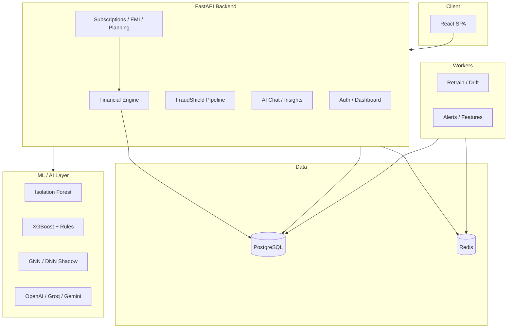

# SmartSpend — Complete Project Overview
### AI-Powered Personal Finance OS (Global)
**Tagline:** *Your money, intelligently shielded.*  
**Repo / codebase name:** Exiqo  
**Prepared for:** AI Biz Impact Eval — *AI for Business Impact (Open Track)*  
**Use:** Share this document with your teammate to build the presentation deck (not a PPT itself).

---

## Table of Contents

1. [Executive Summary](#1-executive-summary)
2. [The Problem We Solve](#2-the-problem-we-solve)
3. [What SmartSpend Does (Product Overview)](#3-what-smartspend-does-product-overview)
4. [Core Modules & Features](#4-core-modules--features)
5. [Business Impact — Revenue, Cost & Risk (30% weight)](#5-business-impact--revenue-cost--risk-30-weight)
6. [Innovation & Uniqueness (20% weight)](#6-innovation--uniqueness-20-weight)
7. [Scalability & Feasibility (20% weight)](#7-scalability--feasibility-20-weight)
8. [AI Integration Depth (20% weight)](#8-ai-integration-depth-20-weight)
9. [Technical Stack (Full Project)](#9-technical-stack-full-project)
10. [Architecture Overview](#10-architecture-overview)
11. [Advantages](#11-advantages)
12. [Disadvantages & Limitations](#12-disadvantages--limitations)
13. [Future Improvements & Roadmap](#13-future-improvements--roadmap)
14. [Suggested PPT Slide Outline](#14-suggested-ppt-slide-outline)
15. [Demo Talking Points](#15-demo-talking-points)

---

## 1. Executive Summary

**SmartSpend** is an end-to-end **AI-native personal finance platform** for global consumers. It connects bank and credit-card data (via statement upload or open-banking-style onboarding), then layers **machine learning, rules engines, and large language models (LLMs)** on top of real transaction data to deliver:

- **Spend visibility** — dashboard, health score, category trends, multi-source breakdown (bank vs credit card)
- **Proactive protection** — 12-phase FraudShield (anomaly detection, pre-payment scanner, investigation console)
- **Money-saving intelligence** — subscription waste detection, dark-pattern traps, EMI burden analysis
- **Planning tools** — festival budgets, big-purchase goals, trip planner with budget constraints
- **Conversational AI** — context-aware chatbot that knows the user’s ledger, not generic finance tips

Unlike a simple expense tracker, SmartSpend treats personal finance as a **unified “Financial OS”**: every module (EMI, festivals, purchases, subscriptions) feeds a central **financial state engine** that recalculates monthly surplus and pushes alerts when the user is overcommitted.

---

## 2. The Problem We Solve

| Pain point | How users suffer today | SmartSpend response |
|------------|------------------------|---------------------|
| **Invisible money leaks** | ₹1 trials, zombie subscriptions, duplicate UPI charges | Dark-pattern detector + Subscription Intelligence verdict engine |
| **Fraud & scams** | UPI fraud, odd-hour debits, merchant impersonation | FraudShield: ML + rules + graph + optional GNN/DNN + pre-pay check |
| **EMI overload** | Multiple loans; no single view of safe borrowing capacity | EMI Tracker: recurring detection, amortization, affordability vs surplus |
| **Festival overspend** | Diwali/Holi spikes break monthly budgets | Festival predictor tied to surplus and historical category spend |
| **Impulse big purchases** | EMI vs cash not compared against real cash flow | Purchase Planner with sacrifice plan and festive discount timing |
| **Fragmented data** | Bank app + card app + no unified picture | PDF/CSV upload, connected sources, merged dashboard scope |
| **Generic AI advice** | ChatGPT doesn’t know your transactions | AI chat + insights grounded in compressed user context from PostgreSQL |

**Target users:** Salaried professionals, Gen-Z earners, and families managing digital payments, subscriptions, and multi-account finances worldwide.

---

## 3. What SmartSpend Does (Product Overview)

### User journey (high level)

1. **Sign up / sign in** — JWT auth, optional OTP, cinematic onboarding intro  
2. **Connect money sources** — upload bank/credit PDFs or connect sources; choose dashboard mode (bank only / card only / merged)  
3. **Automatic enrichment** — transactions parsed, categorized, ML-scored for anomalies  
4. **Daily use** — dashboard KPIs, AI insights, fraud alerts, planning modules  
5. **Action** — cancel subscriptions, postpone purchases, block suspicious payments, chat with AI for explanations  

### Product pillars

| Pillar | One-line description |
|--------|----------------------|
| **See** | Dashboard, transactions, health score (0–100), spending charts |
| **Protect** | FraudShield (12 phases), CyberSafe Connect, transaction checker |
| **Save** | Subscriptions AI, dark patterns, EMI trap detection |
| **Plan** | Festivals, purchase goals, trip planner |
| **Ask** | SmartSpend chatbot + streaming AI insights |

---

## 4. Core Modules & Features

### 4.1 Dashboard & Financial Health

- **KPI cards:** income, expenses, savings rate, anomaly count  
- **Health Score (0–100)** with letter grade (A–F) from savings rate, spend stability, anomalies, subscription burden  
- **Charts:** monthly trend, category pie, source breakdown (bank vs credit card)  
- **AI Financial Command Center:** shortcut cards to high-priority actions (fraud alerts, subscription verdicts, EMI warnings)  
- **Financial State Engine:** recalculates `available_surplus` after any money mutation (EMI, goals, festivals); pushes RED/YELLOW notifications when surplus is critical  

### 4.2 Transactions

- Searchable, sortable ledger with risk badges  
- Scoped by dashboard mode (bank / card / merged)  
- Anomaly flags from Isolation Forest ML pipeline  

### 4.3 AI Insights + SmartSpend Chatbot

- **Insights panel:** LLM-generated narratives from real spend patterns (Groq → OpenAI → Gemini waterfall with 15s timeout per provider)  
- **Chatbot:** SSE streaming; context packet built from DB (never raw rows sent to LLM); supports PDF/CSV upload in chat  
- Jailbreak pattern blocking on chat input  

### 4.4 FraudShield (12-Phase Risk Stack)

Unified fraud pipeline on upload and per-transaction check:

| Phase | Name | Role |
|-------|------|------|
| 1 | Event Engine | Transaction ingestion & scoring pipeline |
| 2 | Feature Store | Behavioural signals materialized from ledger |
| 3 | Supervised Learning | XGBoost-style risk on transaction context |
| 4 | Decision Engine | Thresholds, merchant heuristics, review queue |
| 5 | MLOps & Registry | Model registry, drift monitoring, retrain scheduler |
| 6 | Graph Intelligence | Shared-merchant cluster hints |
| 7 | SHAP Explainability | Factor-style drivers on scans |
| 8 | Feedback Flywheel | Analyst labels improve precision |
| 9 | LLM Investigation Agent | Deep-dive on high-risk items |
| 10 | Graph Neural Network | GraphSAGE-style signals |
| 11 | Deep Neural Network | Shadow DNN scoring |
| 12 | Orchestrator | Routes between models/policies |

**User-facing surfaces:** overview stats, unified alerts, behavior profile, device trust, investigation console, real-time feed, **pre-payment transaction checker** (Hinglish warnings, cybercrime.gov.in link, helpline 1930).

Also includes **Isolation Forest v2** for batch anomaly detection on historical transactions.

### 4.5 Subscriptions AI

- Device-link flow for app usage signals (minutes/sessions per package)  
- **Deterministic verdict engine** (not LLM): KEEP / REVIEW / CANCEL / UPGRADE based on usage deltas  
- Substitution detector (e.g. declining Netflix + growing JioCinema)  
- Subscription graveyard, reminder scheduler, AI summary paragraphs  
- Smart Reminders page for renewal nudges  

### 4.6 Dark Pattern Detector

Rule + LLM analysis of 18 months of transactions for:

- Duplicate charges  
- ₹1 / free-trial traps  
- Zombie subscriptions  
- Escalating micro-charges  
- Price increases  

### 4.7 EMI Tracker

- Auto-detect recurring loan/EMI debits from merchants (HDFC, Bajaj, NACH, etc.)  
- Loan EMI calculator (principal, rate, tenure → amortization)  
- **EMI trap detector:** total burden vs monthly surplus  
- Affordability check before taking new EMI  

### 4.8 Festivals & Event Planner

- Indian festival calendar (Holi, Diwali, Eid, etc.) with typical spend categories  
- Budget provisioning tied to **financial constraints** (surplus snapshot)  
- Groq-backed English advice for overspend risk  

### 4.9 Purchase Planner

- Big-ticket goals (appliances, electronics, travel)  
- EMI vs cash comparison using real loan math  
- Sacrifice plan (which categories to cut)  
- Best-buy timing (e.g. Diwali sales for appliances)  

### 4.10 Trip Planner (AI Actions)

- Agentic trip planning with **Travel Intelligence MCP** (stdio)  
- Budget optimizer respects user financial constraints  
- SSE streaming of agent reasoning + itinerary cards  

### 4.11 CyberSafe Connect (Risk Awareness)

- Educational flow for cyber fraud awareness  
- Complements FraudShield with consumer-facing safety content  

### 4.12 Document Upload & Connected Sources

- **PDF parsing:** pdfplumber + PyMuPDF + optional Tesseract OCR for scanned statements  
- Supports CSV, XLSX  
- Indian bank detection from statement text (Axis, HDFC, ICICI, SBI, etc.)  
- `connected_sources` table: institution name, source type, visibility toggles  
- Dashboard mode: `bank_only` | `credit_card_only` | `merged`  

### 4.13 Settings & Onboarding

- Connected accounts management  
- Source selection after signup  
- Account Aggregator modal (AA) for regulated open-banking style connect (demo-ready)  

---

## 5. Business Impact — Revenue, Cost & Risk (30% weight)

> **Pitch angle:** SmartSpend moves users from *reactive* (checking passbooks) to *proactive* (blocked fraud, canceled waste, planned festivals). Quantify with illustrative numbers in the deck; adjust to your pilot data if available.

### 5.1 Cost reduction (direct savings for users)

| Mechanism | Typical impact | Example |
|-----------|----------------|---------|
| Subscription cancellation | ₹199–₹1,499/month per unused app | 3 zombie OTT apps → **₹600–₹4,500/month saved** |
| Dark pattern duplicate charges | Recovery of erroneous debits | 2 duplicate UPI × ₹500 → **₹1,000 recovered** |
| EMI affordability guard | Avoids over-leveraging | Prevents new ₹15k EMI when surplus is ₹8k |
| Festival budget caps | Reduces unplanned spike spend | Diwali budget vs ₹40k unplanned splurge |
| Purchase postpone | Defers non-essential buys | 90-day postpone → opportunity cost avoided |

**Annualized user value (illustrative):** ₹15,000 – ₹60,000/year in avoided waste + better timing — higher for multi-subscription, multi-EMI households.

### 5.2 Risk reduction (fraud & financial distress)

| Risk | Without SmartSpend | With SmartSpend |
|------|-------------------|-----------------|
| UPI / card fraud | User notices days later | Real-time check + alert + investigation agent |
| Scam payment | Money lost | Pre-pay scanner blocks or warns (risk score, Hinglish message) |
| Overcommitment | Silent EMI + festival + rent breach | Surplus engine → RED alert when ≤ ₹0 |
| Poor financial literacy | No explainability | SHAP factors + LLM investigation narrative |

**Business angle for B2B2C:** Banks, neobanks, and fintech apps can embed FraudShield + health score APIs to reduce **chargeback losses**, **support tickets**, and **NPAs** from over-leveraged retail borrowers.

### 5.3 Revenue opportunities (platform / business model)

| Model | Description |
|-------|-------------|
| **Freemium SaaS** | Free dashboard + paid FraudShield Pro / Subscription AI |
| **B2B API licensing** | White-label fraud scoring + insights for fintech partners |
| **Affiliate / ethical upsell** | Cheaper substitute apps when verdict = CANCEL (subscription graph) |
| **Premium planning** | Trip planner, purchase planner as paid tier |
| **Enterprise** | MLOps + investigation console for bank fraud ops teams |

### 5.4 Operational impact (if deployed at scale)

- **Automated statement ingestion** → lower manual support for “where is my money”  
- **Deterministic subscription verdicts** → predictable outcomes vs pure LLM (compliance-friendly)  
- **Feedback flywheel** → model improvement without full re-engineering  

### 5.5 Metrics to cite in the deck (define targets)

- **Health Score** improvement over 90 days  
- **₹ saved** from subscription recommendations accepted  
- **Fraud alerts** raised vs false-positive rate (with feedback loop)  
- **Surplus warnings** acted upon before month-end  
- **Time to insight** — upload statement → dashboard populated (seconds vs manual Excel)

---

## 6. Innovation & Uniqueness (20% weight)

### What makes SmartSpend different

1. **Unified Financial OS, not siloed apps**  
   EMI + festivals + purchases + subscriptions all feed one `recalculate_financial_state()` — competitors usually treat these as separate features.

2. **12-phase FraudShield in a consumer PFM app**  
   Enterprise-grade stack (XGBoost, graph, GNN, DNN shadow, orchestrator, SHAP, LLM investigator) packaged for retail users.

3. **Hybrid AI architecture**  
   - **Deterministic** where trust matters (subscription verdicts, EMI math, health score)  
   - **LLM** where language and explanation matter (insights, chat, investigations)  
   - **Classical ML** for anomaly detection (Isolation Forest per user)

4. **India-first design**  
   - Indian festival calendar, INR formatting, Hinglish fraud warnings  
   - Bank statement parsers tuned for Axis, HDFC, ICICI, SBI patterns  
   - UPI-heavy transaction categories and merchant heuristics  

5. **LLM waterfall & graceful degradation**  
   Groq → OpenAI → Gemini with timeouts; app works with partial API keys.

6. **Context-grounded chatbot**  
   Compressed context packet from PostgreSQL — not generic ChatGPT finance tips.

7. **MCP-powered Trip Planner**  
   Agent + external Travel Intelligence MCP — modern agentic pattern.

8. **Pre-payment fraud check**  
   User can paste/scenario-check a transaction *before* paying — rare in PFM apps.

---

## 7. Scalability & Feasibility (20% weight)

### 7.1 What scales well today

| Layer | Approach |
|-------|----------|
| **API** | FastAPI async routes; stateless JWT auth → horizontal pod scaling |
| **Database** | PostgreSQL with indexed transactions, monthly_summary, migrations (36+ migration files) |
| **ML inference** | Per-user Isolation Forest models in memory; XGBoost/GNN paths optional |
| **Events** | Redis-backed event bus + workers (retrain feed, alert consumer, feature materializer, drift monitor) |
| **LLM** | Provider waterfall; rate limits on trip planner (10 msg/min/user) |
| **Feature store** | Online store + sync materializer + memory cache fallback |

### 7.2 Deployment feasibility (current state)

- **Runs locally:** `uvicorn` backend (port 8000/8001) + React CRA frontend (port 3000)  
- **Scripts:** `start-dev.ps1`, `start-backend.ps1`, `start-frontend.ps1`  
- **Env-driven:** `.env` for DB, OpenAI, Groq, Gemini, Redis  
- **Demo-ready:** Seeded personas (e.g. Vikram Singh), sample PDF statements in `test samples/`  

### 7.3 Scale path (production)

```
                    ┌─────────────┐
   Users ─────────► │  CDN + SPA  │ (React build)
                    └──────┬──────┘
                           │
                    ┌──────▼──────┐
                    │  API Gateway │
                    └──────┬──────┘
           ┌───────────────┼───────────────┐
    ┌──────▼──────┐ ┌──────▼──────┐ ┌─────▼─────┐
    │ FastAPI     │ │ Workers     │ │ Redis     │
    │ replicas    │ │ (Celery/    │ │ pub/sub   │
    │             │ │  K8s jobs)  │ │           │
    └──────┬──────┘ └──────┬──────┘ └───────────┘
           │               │
    ┌──────▼───────────────▼──────┐
    │ PostgreSQL (+ read replicas) │
    └─────────────────────────────┘
```

- Move ML model cache to **Redis** or model server (TorchServe / Triton) for multi-instance APIs  
- **Partition** `transactions` by `user_id` / month for large corpora  
- **Batch PDF parsing** via queue (S3 upload → worker → DB insert)  
- **LLM cost control:** cache insights per user per day; use Groq for high-volume, GPT-4o-mini for quality tier  

### 7.4 Feasibility constraints (honest)

- Full torch/GNN stack needs GPU nodes or is run in shadow mode  
- Redis + async workers required for Phase 1–8 risk engine at full strength  
- OCR quality depends on Tesseract install and statement scan quality  
- Regulatory: live AA (Account Aggregator) needs RBI-licensed FIP/FIU integration — currently demo/upload path  

---

## 8. AI Integration Depth (20% weight)

### 8.1 AI/ML components map

| Component | Technique | Where used |
|-----------|-----------|------------|
| Anomaly detection | Isolation Forest v2 (8 features, per-user scaler) | Transactions, dashboard alerts |
| Fraud scoring | XGBoost + rules + graph features | FraudShield pipeline |
| Graph intelligence | Merchant graphs, GraphSAGE-style (Phase 10) | Fraud rings, clusters |
| Deep learning | DNN shadow scorer (Phase 11) | High-risk path |
| Orchestration | Routing policy across models (Phase 12) | Final allow/block/review |
| Explainability | SHAP-style factor scores | Transaction checker UI |
| Investigation | LLM agent with tools (geo, merchant, blacklist) | Investigation console |
| Insights | Multi-LLM waterfall JSON generation | AI Insights panel |
| Chat | Context packet + streaming SSE + jailbreak guard | SmartSpend chatbot |
| Dark patterns | Rules + GPT narrative | Dark Pattern Detector |
| Subscriptions | Deterministic verdict + optional LLM paragraph | Subscription Hub |
| Festival / Purchase | Groq advice on structured financial snapshot | Planning modules |
| Trip planner | Agent + MCP tools | AI Actions |
| PDF understanding | pdfplumber, PyMuPDF, Tesseract OCR | Statement upload |
| Pattern prediction | Pattern predictor service | Spending alerts |

### 8.2 LLM providers

- **OpenAI** — GPT-4o-mini (insights, chat, dark patterns)  
- **Groq** — Llama 3.3 70B (fast festival/purchase advice, fallback chat)  
- **Google Gemini** — tertiary fallback in insights waterfall  

### 8.3 Data → AI pipeline (no hallucinated balances)

```
PostgreSQL (transactions, EMI, goals, festivals)
        │
        ▼
Context compression (ai_context_service)
        │
        ├──► Deterministic engines (verdict, health score, surplus)
        │
        └──► LLM (insights, chat, investigation) — structured JSON prompts
```

### 8.4 MLOps maturity

- MLflow model registry  
- Drift monitor worker  
- Retrain scheduler + retrain feed consumer  
- Shadow logging for DNN  
- Prometheus + structlog (observability hooks)  

---

## 9. Technical Stack (Full Project)

### 9.1 Frontend

| Technology | Version / notes |
|------------|-----------------|
| **React** | 18.2 (Create React App) |
| **TypeScript** | Partial (TSX components + JS coexist) |
| **Tailwind CSS** | 3.4 + custom design tokens (`exiqo-*`, `ss-brand`) |
| **Framer Motion** | Animations, intro splash, sidebar |
| **Recharts** | Spending / trend charts |
| **Axios** | API client (`services/api.js`, `riskApi.js`) |
| **Lucide React** | Icons |
| **cmdk** | Command palette |
| **Testing** | React Testing Library, Jest (`setupTests.js`) |

### 9.2 Backend

| Technology | Version / notes |
|------------|-----------------|
| **Python** | 3.11+ (tested 3.13) |
| **FastAPI** | 0.115 |
| **Uvicorn** | ASGI server |
| **PostgreSQL** | Primary datastore (`psycopg2` + `asyncpg` for risk engine) |
| **Redis** | Event bus, caching (optional but recommended) |
| **Pydantic** | 2.9 request/response models |
| **JWT** | `python-jose` + bcrypt passwords |

### 9.3 ML / Data Science

| Library | Use |
|---------|-----|
| **scikit-learn** | Isolation Forest, preprocessing |
| **pandas / numpy** | Feature engineering |
| **XGBoost** | Supervised fraud scoring |
| **PyOD** | Additional anomaly algorithms |
| **SHAP** | Explainability |
| **PyTorch** | GNN / DNN phases (optional `requirements-torch.txt`) |
| **MLflow** | Experiment tracking & registry |

### 9.4 AI / LLM

| Library | Use |
|---------|-----|
| **openai** SDK | OpenAI + Groq-compatible client |
| **google-generativeai** | Gemini fallback |
| **mcp** | Model Context Protocol for Trip Planner travel server |

### 9.5 Document processing

| Library | Use |
|---------|-----|
| **pdfplumber** | PDF text extraction |
| **PyMuPDF** | PDF rendering / fallback |
| **pytesseract** | OCR for scanned statements |
| **openpyxl / xlrd** | Excel statements |

### 9.6 Infrastructure & DevOps

| Tool | Use |
|------|-----|
| **APScheduler** | Background retrain, review queue |
| **Workers** | `retrain_feed_consumer`, `alert_consumer`, `feature_materializer`, `drift_monitor_worker` |
| **PowerShell scripts** | `start-dev.ps1`, `test-karan-full.ps1`, `test-vikram-bank.ps1` |
| **pytest** | Backend tests (`test_emi_calculator.py`, phase tests) |

### 9.7 Repository structure (top level)

```
exiqo/
├── backend/           # FastAPI app, routes, services, workers, tests
├── frontend/          # React SPA
├── database/          # schema.sql, seeds, migrations
├── test samples/      # Realistic Indian bank PDFs (demo)
├── scripts/           # Utility patch scripts
├── presentations/     # Deck generator (Python)
├── start-dev.ps1
└── .env               # Secrets (DB, API keys) — not committed
```

---

## 10. Architecture Overview



**Key design principle:** After any write that affects money (EMI, purchase goal, festival budget), call `recalculate_financial_state()` so dashboard, planners, and alerts stay consistent.

---

## 11. Advantages

1. **All-in-one** — See, protect, save, plan, and ask in one app  
2. **Real data, not surveys** — Insights from actual bank/card transactions  
3. **Explainable fraud** — SHAP factors + human-readable LLM investigation  
4. **India-specific** — Festivals, banks, INR, UPI patterns, Hinglish warnings  
5. **Resilient AI** — Multi-provider waterfall; deterministic fallbacks for subscriptions  
6. **Modern UX** — Dark glass UI, animations, mobile-friendly sidebar  
7. **Extensible** — Modular routes/services; MCP for new agent tools  
8. **Demo-rich** — Sample Vikram statements, QA scripts, seeded data  
9. **Enterprise-grade fraud path** — Can upsell to B2B fraud ops  
10. **Open architecture** — Standard PostgreSQL + REST; no vendor lock-in on data  

---

## 12. Disadvantages & Limitations

1. **Complexity** — 12-phase fraud stack is heavy for a hackathon jury to absorb; needs simple storytelling  
2. **Infrastructure dependency** — Full risk engine wants Redis + multiple workers + optional GPU  
3. **LLM cost & latency** — Insights/chat quality depends on API keys; offline mode limited  
4. **Statement OCR** — Scanned/low-quality PDFs may parse imperfectly  
5. **No live production AA yet** — Account Aggregator is demo-oriented; real RBI integration is a separate compliance project  
6. **Mixed JS/TS frontend** — Some tech debt between `.jsx` and `.tsx`  
7. **CRA frontend** — Not Next.js; SSR/SEO not a focus (app is behind login)  
8. **Model cold start** — New users need enough transactions for ML to be meaningful  
9. **False positives** — Aggressive fraud rules may alert on legitimate odd transactions (mitigated by feedback loop)  
10. **Windows dev friction** — Torch/long-path issues documented in requirements comments  

---

## 13. Future Improvements & Roadmap

### Short term (0–3 months)

- [ ] Production Account Aggregator (Setu / Finvu / bank FIPs)  
- [ ] Mobile app (React Native) or PWA with push notifications  
- [ ] Improve PDF parser coverage for more Indian banks  
- [ ] User-facing “₹ saved this month” dashboard widget  
- [ ] Reduce FraudShield UI complexity — “Simple / Advanced” mode  

### Medium term (3–6 months)

- [ ] Family / joint account views  
- [ ] Bill pay reminders integrated with UPI deep links  
- [ ] Credit score / bureau API (CIBIL) for EMI recommendations  
- [ ] Hindi + regional language for insights and fraud warnings  
- [ ] Kubernetes Helm chart + Terraform for one-click deploy  

### Long term (6–12 months)

- [ ] B2B API marketplace for banks  
- [ ] Federated learning for fraud (privacy-preserving)  
- [ ] Voice assistant (“Hey SmartSpend, can I afford this?”)  
- [ ] SMB variant (GST, vendor payments)  
- [ ] Regulatory reporting helpers for tax (80C, capital gains hints)  

---

## 14. Suggested PPT Slide Outline

> Map slides to competition weights: **Business impact first (30%)**, then innovation, scalability, AI depth, clarity.

| # | Slide title | Content focus | Weight |
|---|-------------|---------------|--------|
| 1 | Title | SmartSpend — Your money, intelligently shielded | — |
| 2 | Problem | Indian users lose money to fraud, subscriptions, EMI, festivals | Impact |
| 3 | Solution | One Financial OS: See · Protect · Save · Plan · Ask | Impact |
| 4 | Product demo screenshot | Dashboard + health score | Clarity |
| 5 | **Business impact** | ₹ saved, fraud prevented, surplus alerts | **30%** |
| 6 | FraudShield | 12 phases → pre-pay check (diagram) | AI + Impact |
| 7 | Subscriptions AI | Verdict engine + substitution | Innovation |
| 8 | Planning suite | EMI + Festival + Purchase | Impact |
| 9 | **Innovation** | Unified financial engine + hybrid AI | **20%** |
| 10 | **AI depth** | ML + LLM + MCP agent map | **20%** |
| 11 | **Scalability** | Architecture + scale path | **20%** |
| 12 | Tech stack | One-slide table (Section 9) | Clarity |
| 13 | Traction / demo | Vikram persona, sample statements | Clarity |
| 14 | Business model | Freemium + B2B API | Impact |
| 15 | Roadmap | Section 13 highlights | Feasibility |
| 16 | Team & ask | What you need from judges / investors | Clarity |

---

## 15. Demo Talking Points

Use these when recording or presenting live:

1. **Upload** an Axis/HDFC sample PDF → show transactions appearing.  
2. **Dashboard** → Health Score, “where did my money go” pie chart.  
3. **FraudShield** → Run transaction checker on a suspicious UPI scenario → show risk score + Hinglish warning.  
4. **Subscriptions** → Show CANCEL verdict on unused app + cheaper substitute.  
5. **Dark Patterns** → Flag duplicate charge or ₹1 trap.  
6. **EMI** → Total EMI vs surplus; “can I afford this loan?”  
7. **Festival** → Diwali budget vs predicted overspend.  
8. **AI Chat** → “Why was my health score 62?” — grounded answer from their data.  

**Closing line:** *SmartSpend doesn’t just show what you spent — it protects what you keep.*

---

## Appendix A — API Route Summary (Backend)

| Prefix | Module |
|--------|--------|
| `/api/auth` | Sign up, sign in, JWT |
| `/api/dashboard` | Summary, source breakdown |
| `/api/transactions` | CRUD, filters |
| `/api/insights` | AI insights generation |
| `/api/ai` | Chatbot SSE, session, upload |
| `/api/fraud-shield` | Alerts, check-transaction, stats |
| `/api/subscription-intelligence` | Verdicts, usage, reminders |
| `/api/dark-patterns` | Trap detection |
| `/api/emi` | EMI report, affordability |
| `/api/festivals` | Festival predictor |
| `/api/purchases` | Purchase planner |
| `/api/documents` | Upload, connected sources |
| `/api/ai-actions/trip-planner` | Trip agent |
| `/api/risk-profile`, `/api/investigations`, etc. | Phase 1–8 risk engine (admin/analyst) |

---

## Appendix B — Competition Criteria Checklist

| Criterion | Weight | Where covered in this doc |
|-----------|--------|----------------------------|
| Business impact (Revenue/Cost/Risk) | 30% | Section 5 |
| Innovation & uniqueness | 20% | Section 6 |
| Scalability & feasibility | 20% | Section 7 |
| AI integration depth | 20% | Section 8 |
| Presentation & clarity | 10% | Sections 14–15 + slide outline |

---

*Document generated from the Exiqo / SmartSpend codebase. Update ₹ figures and metrics with your pilot or user-test data before the final pitch.*
